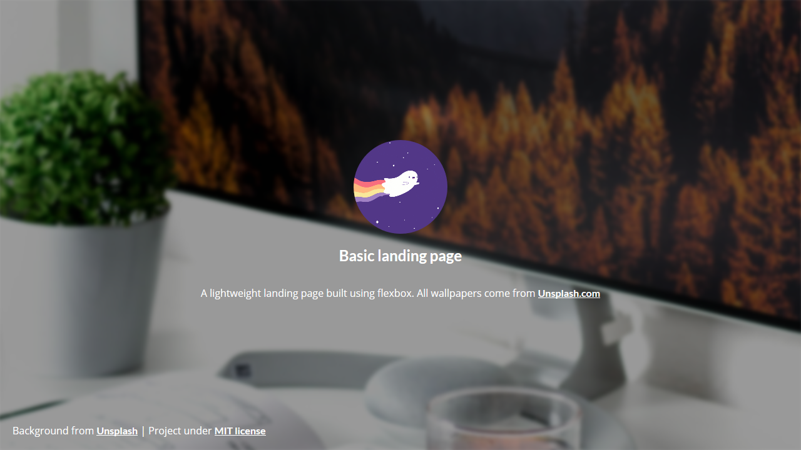

# Basic landing page

> A lightweight landing page

[![GitHub issues][github-issues]][github-issueslink]
[![GitHub stars][github-stars]][github-starslink]
[![GitHub forks][github-forks]][github-forkslink]

Create a simple landing page in minutes. You just need to clone this repository and edit the `index.html` file.

## Release History

- 2.0.0
  - Better with a fresh new workspace
- 1.2.0
  - Add: Zone for a profile photo
- 1.1.0
  - A colourful world
  - ADD: Button
  - ADD: Using Gulp to minimize files
- 1.0.0
  - First commit

## Meta

**LucasCtrl** – [@LucasCtrlAlt](https://twitter.com/lucasctrlalt) – lucasalt@protonmail.com

Distributed under the MIT license. See `LICENSE` for more information.

[https://github.com/LucasCtrl/basic-landing-page/blob/master/LICENSE](https://github.com/LucasCtrl/Basic-landing-page/blob/master/LICENSE)

## Contributing

1. Fork it (<https://github.com/LucasCtrl/Basic-landing-page/fork>)
2. Create your feature branch (`git checkout -b feature/fooBar`)
3. Commit your changes (`git commit -am 'Add some fooBar'`)
4. Push to the branch (`git push origin feature/fooBar`)
5. Create a new Pull Request

<!-- Markdown link & img dfn's -->

[github-issues]: https://img.shields.io/github/issues/LucasCtrl/Basic-landing-page.svg?style=flat-square
[github-issueslink]: https://github.com/LucasCtrl/Basic-landing-page/issues
[github-stars]: https://img.shields.io/github/stars/LucasCtrl/Basic-landing-page.svg?style=flat-square
[github-starslink]: https://github.com/LucasCtrl/Basic-landing-page/stargazers
[github-forks]: https://img.shields.io/github/forks/LucasCtrl/Basic-landing-page.svg?style=flat-square
[github-forkslink]: https://github.com/LucasCtrl/Basic-landing-page/network
